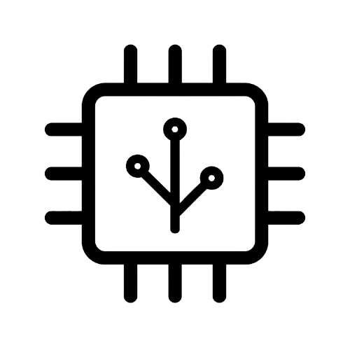

<div align="center">
   
	<h1 align="center"><b>Release Flow</b></h1>
	<p align="center">
		Release Flow is a tool to automate the release process for Rust projects.
  </p>
</div>

<br/>

# Release Flow - Automated Semantic Release in Rust

Release Flow is a tool to automate the release process for Rust projects. It is designed to be used as a GitHub Action, providing a seamless experience for managing versions, generating changelogs, and creating GitHub releases.

## Features

- 🚀 **Automated Versioning**: Calculates the next version based on Conventional Commits.
- 📝 **Changelog Generation**: Automatically generates a changelog from your commit history.
- 📦 **GitHub Releases**: Creates a new release on GitHub with the generated changelog and assets.
- 🦀 **Pure Rust**: Written entirely in Rust with zero external dependencies (no Node.js, Python, etc.).
- ⚡ **Fast & Lightweight**: Efficient execution suitable for CI/CD pipelines.

## Usage

### GitHub Action

To use Release Flow in your GitHub Actions workflow, add the following step to your `.github/workflows/release.yml`:

```yaml
name: Release

on:
  push:
    branches:
      - main

permissions:
  contents: write

jobs:
  release:
    runs-on: ubuntu-latest
    steps:
      - name: Checkout code
        uses: actions/checkout@v4
        with:
          fetch-depth: 0 # Required to access git history

      - name: Run Release Flow
        id: release
        uses: shujaakbar2020/release-flow@v1
        with:
          github-token: ${{ secrets.GITHUB_TOKEN }}
          dry-run: 'false'
```

### Inputs

| Input | Description | Required | Default |
| :--- | :--- | :--- | :--- |
| `github-token` | Your GitHub Token (usually `${{ secrets.GITHUB_TOKEN }}`) | Yes | N/A |
| `dry-run` | If set to `true`, calculates the version and generates changelog but skips release creation. | No | `false` |

### Outputs

| Output | Description |
| :--- | :--- |
| `version` | The new calculated version (e.g., `1.2.3`). |
| `tag` | The new tag created (e.g., `v1.2.3`). |

## Local Usage

You can also run Release Flow locally if you have Rust installed.

1.  **Install**:
    ```bash
    cargo install --path .
    ```

2.  **Run**:
    ```bash
    # Dry run to see what would happen
    release-flow --dry-run

    # Create a release (requires GITHUB_TOKEN env var)
    export GITHUB_TOKEN=your_token
    release-flow
    ```

## License

This project is licensed under the MIT License.
